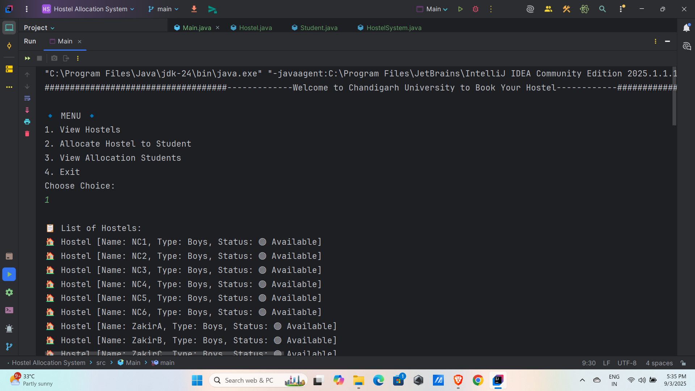
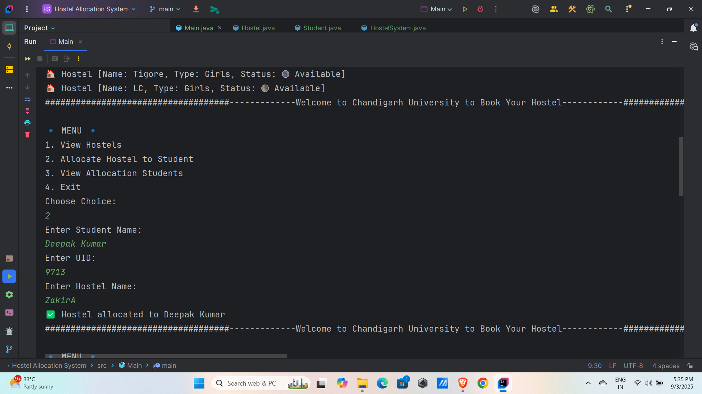
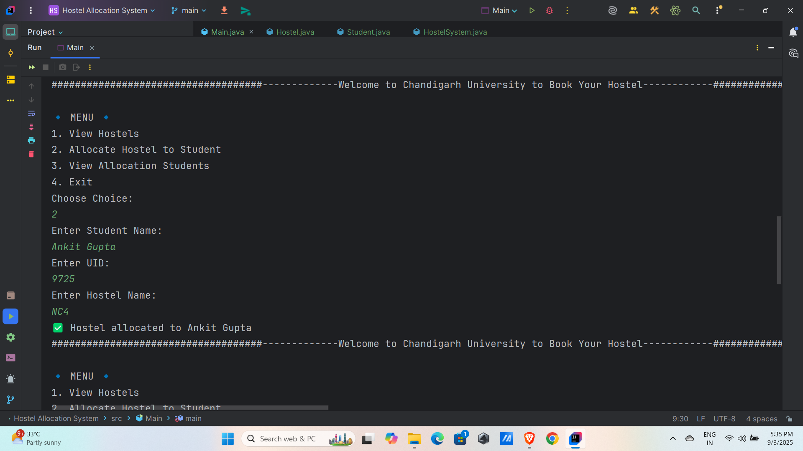
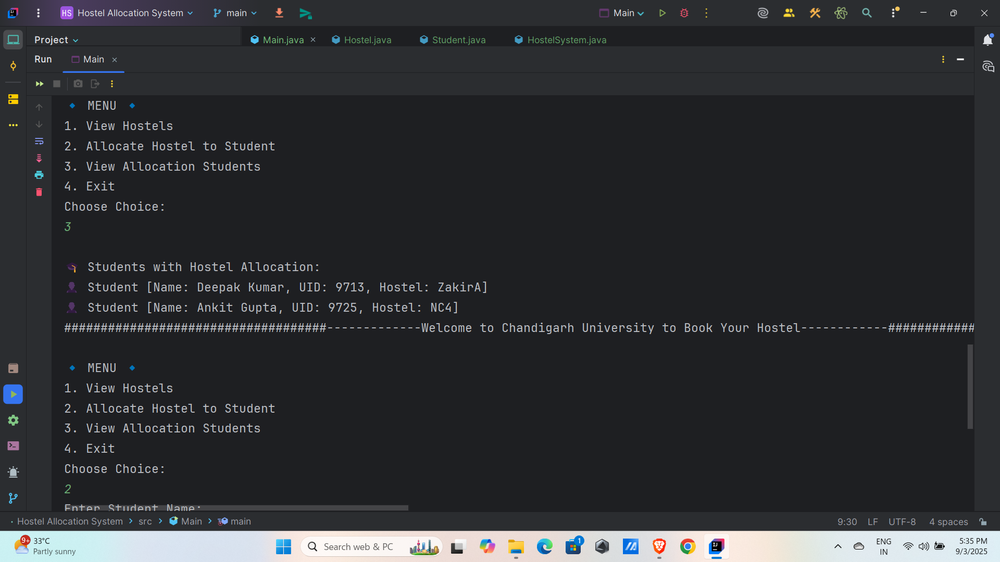
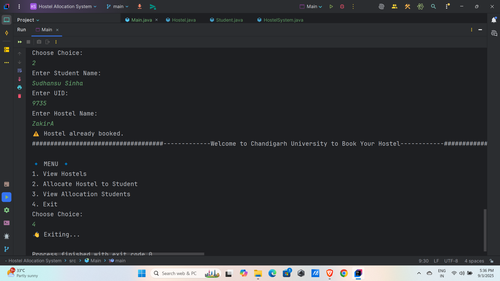

# Hostel_Allocation_Mini_Project-java-OOPs
This is a mini Java OOPs project designed to strengthen my understanding of Object-Oriented Programming (OOP) concepts and enhance my core Java skills.

## 📸 Project Outputs

### Output 1

### Output 2

### Output 3

### Output 4

### Output 5

